<div align="center">

# 👋 Hi, I'm Ruditha Yukthika

### `Developer • Designer • Learner`

<br/>

<!-- Animated Typing Subtitle -->


<br/><br/>

<!-- Custom Animated Coding Character Visual -->


<br/><br/>

<!-- Profile Views Counter -->
<p align="center">
  
</p>

</div>

---

## 👨💻 About Me

I'm Ruditha, a developer and UI/UX designer who enjoys building applications, creating clean interfaces, and learning new technologies. I work with web, mobile, backend, and networking technologies, with a current focus on Flutter, Python, and modern development tools.

---

## 💻 Programming Languages

<p align="left">
  
  
  
  
</p>

---

## 🛠️ Technologies & Tools

### 🌐 Web & Backend

<p align="left">
  
  
  
  
  
  
  
</p>

* **HTML5** & **CSS3**
* **React**
* **Node.js** & **Express.js**
* **Spring Boot**
* **REST APIs**

<br/>

### 📱 Mobile Development

<p align="left">
  
  
  
</p>

* **Flutter**
* **Dart**
* **React Native**

<br/>

### 🎨 UI / UX Design

<p align="left">
  
  
  
  
  
</p>

* **Figma**
* **Wireframing**
* **Prototyping**
* **UX Research**
* **Responsive Design**

<br/>

### 🗄️ Database

<p align="left">
  
  
</p>

* **MySQL**
* **MongoDB**

<br/>

### 🌐 Networking

<p align="left">
  
  
  
  
</p>

* **Cisco Packet Tracer**
* **IP Addressing**
* **Routing**
* **Network Design**

<br/>

### 🔧 Development Tools & Hardware

<p align="left">
  
  
  
  
  
  
  
</p>

* **Git** & **GitHub**
* **VS Code**
* **IntelliJ IDEA**
* **Jupyter**
* **WordPress**
* **Arduino**

---

## 🤝 Connect With Me

<p align="left">
  <a href="https://github.com/it24102858" target="_blank">
    
  </a>
  &nbsp;
  <a href="https://www.linkedin.com/in/ruditha-yukthika-57a239298/" target="_blank">
    
  </a>
</p>

---

<div align="center">

`⚡ Code. Create. Improve.`

```text
while (learning) {
    code();
    create();
    improve();
}
```

**Thanks for visiting my profile! 🚀**

</div>
